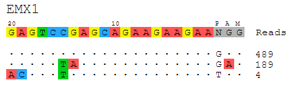

[![Version][version-shield]][version-url]
[![Python versions][python-shield]][python-url]
[![Platforms][platform-shield]][python-url]

# guideseq: The GUIDE-Seq Analysis Package

The guideseq package implements our data preprocessing and analysis pipeline for GUIDE-Seq data. It takes raw sequencing reads (FASTQ) and a parameter manifest file (.yaml) as input and produces a table of annotated off-target sites as output.

## Table of Contents
- [Features](#features)
- [Dependencies](#dependencies)
- [Getting Set Up](#setup)
	- [Installation](#Installation)
	- [Quickstart](#Quickstart)
- [Running the Full Analysis Pipeline](#full_pipeline)
	- [Quickstart](#quickstart)
	- [Writing A Manifest File](#write_manifest)
	- [A Full Manifest File Example](manifest_example)
	- [Pipeline Outputs](#pipeline_output)
- [Running Analysis Steps Individually](#)
	- [Demultiplex](#demultiplex)
	- [UMItag](#umitag)
	- [Consolidate](#consolidate)
	- [Align](#align)
	- [Identify](#identify)
	- [Filter](#filter)
	- [Visualize](#visualize)
- [Frequently Asked Questions](#FAQ)
	- [How do I Run the Pipeline with Demultiplexed Data?](#demultiplexed_run)
	- [Can I analyze data without UMIs?](#no_umis)


## Features<a name="features"></a>


The package implements a pipeline consisting of a read preprocessing module followed by an off-target identification module. The preprocessing module takes raw reads (FASTQ) from a pooled multi-sample sequencing run as input. Reads are demultiplexed into sample-specific FASTQs and PCR duplicates are removed using unique molecular index (UMI) barcode information.


The individual pipeline steps are:

1. **Sample demultiplexing**: A pooled multi-sample sequencing run is demultiplexed into sample-specific read files based on sample-specific dual-indexed barcodes
2. **PCR Duplicate Consolidation**:Reads that share the same UMI and the same first six bases of genomic sequence are presumed to originate from the same pre-PCR molecule and are thus consolidated into a single consensus read to improve quantitative interpretation of GUIDE-Seq read counts.
3. **Read Alignment**: The demultiplexed, consolidated paired end reads are aligned to a reference genome using the BWA-MEM algorithm with default parameters (Li. H, 2009).
4. **Candidate Site Identification**: The start mapping positions of the read amplified with the tag-specific primer (second of pair) are tabulated on a genome-wide basis. Start mapping positions are consolidated using a 10-bp sliding window. Windows with reads mapping to both + and - strands, or to the same strand but amplified with both forward and reverse tag-specific primers, are flagged as sites of potential DSBs. 25 bp of reference sequence is retrieved on either side of the most frequently occuring start-mapping position in each flagged window. The retrieved sequence is aligned to the intended target sequence using a Smith-Waterman local-alignment algorithm. 
5. **False positive filtering**: Off-target cleavage sites with more than six mismatches to the intended target sequence, or that are present in background controls, are filtered out.
6. **Reporting**: Identified off-targets, sorted by GUIDE-Seq read count are annotated in a final output table. The GUIDE-Seq read count is expected to scale approximately linearly with cleavage rates (Tsai et al., *Nat Biotechnol.* 2015).
7. **Visualization**: Alignment of detected off-target sites is visualized via a color-coded sequence grid, as seen below:



## Dependencies<a name="dependencies"></a>
* Python 2 or 3
* Reference genome fasta file ([Example](http://www.broadinstitute.org/ftp/pub/seq/references/Homo_sapiens_assembly19.fasta))
* [`bwa`](<http://bio-bwa.sourceforge.net/>) alignment tool
* [`bedtools`](<http://bedtools.readthedocs.org/en/latest/>) genome arithmetic utility


## Getting Set Up<a name="setup"></a>

### Installation<a name="Installation"></a>

The most easiest way to install guideseq pipeline is via conda.

```

conda create -n guideseq -c conda-forge -c bioconda -c anaconda -c omnia -c tsailabSJ guide_seq

source activate guideseq

guideseq.py -h

## BWA and bedtools are automatically installed


```

Alternatively, you can git clone this repository and install

```

git clone https://github.com/tsailabSJ/guideseq

cd guideseq

pip install -r requirements.txt

python setup.py install

guideseq.py -h

## Please install BWA and bedtools if you choose this option

```

- **Burrows-Wheeler Aligner (bwa)**: You can either install bwa with a package manager (e.g. `brew` on OSX or `apt-get` on Ubuntu/Debian), or you can download it from the [project page](http://bio-bwa.sourceforge.net/) and compile it from source.
- **Bedtools**: You can either install bwa with a package manager (e.g. `brew` or `apt-get`), or you can download it from the [project page](http://bedtools.readthedocs.org/en/latest/content/installation.html) and compile it from source.

For both bwa and bedtools, make sure you know the path to the respective executables, as they need to be specified in the pipeline manifest file.


### Quickstart <a name="Quickstart"></a>

```

git clone https://github.com/tsailabSJ/guideseq

cd guideseq/test

guideseq.py all -m test_manifest.yaml

```

## Running the Full Analysis Pipeline<a name="full_pipeline"></a>

### Quickstart<a name="quickstart"></a>

To run the full guideseq analysis pipeline, you must first create a manifest YAML file that describes all pipeline inputs. Once you have done so, you can simply run

```
guideseq.py all -m /path/to/manifest.yaml
```

to run the entire pipeline. Below are specific instructions detailing how to write the manifest file.

If you wish to run an example on our abridged test data, you can simply run

```

cd guideseq/test


guideseq.py all -m test_manifest.yaml
```
from the guideseq root directory. The `test_manifest` assumes that both the `bwa` and `bedtools`executables are in your system PATH. You will see the pipeline results outputted to the `test/output` folder.

### Writing A Manifest File<a name="write_manifest"></a>
When running the end-to-end analysis functionality of the guideseq package, a number of inputs are required. To simplify the formatting of these inputs and to encourage reproducibility, these parameters are inputted into the pipeline via a manifest formatted as a YAML file. YAML files allow easy-to-read specification of key-value pairs. This allows us to easily specify our parameters. The following fields are required in the manifest:

- `reference_genome`: The absolute path to the reference genome FASTA file.
- `output_folder`: The absolute path to the folder in which all pipeline outputs will be saved.
- `bwa`: The absolute path to the `bwa` executable
- `bedtools`: The absolute path to the `bedtools` executable
- `PAM`: PAM sequence (optional), default is NGG.
- `undemultiplexed`: The absolute paths to the undemultiplexed paired end sequencing files. The required parameters are:
	- `forward`: The absolute path to the FASTQ file containing the forward reads.
	- `reverse`: The absolute path to the FASTQ file containing the reverse reads.
	- `index1`: The absolute path to the FASTQ file containing the forward index reads.
	- `index2`: The absolute path to the FASTQ file containing the reverse index reads.

An example `undemultiplexed` field:

```
undemultiplexed:
    forward: ../test/data/undemux.r1.fastq.gz
    reverse: ../test/data/undemux.r2.fastq.gz
    index1: ../test/data/undemux.i1.fastq.gz
    index2: ../test/data/undemux.i2.fastq.gz
```

- `samples`: A nested field containing the details of each sample. At least two samples must be specified: a "control" sample (to be used to filter out background off-target sites) and at least one treatment sample. The required parameters are:
	- `target`: The sample targetsites
	- `barcode1`: The forward barcode
	- `barcode2`: The reverse barcode
	- `description`: A description of the sample

An example `samples` field:

```
samples:
    control:
        target:
        barcode1: CTCTCTAC
        barcode2: CTCTCTAT
        description: Control

    [SAMPLENAME]:
        target: GAGTCCGAGCAGAAGAAGAANGG
        barcode1: TAGGCATG
        barcode2: TAGATCGC
        description: EMX1
```

### A Full Manifest File Example<a name="manifest_example"></a>

Below is an example of a full manifest file. Feel free to copy it and replace the parameters with your own experiment data. Remember that you can input more than just one treatment sample (e.g. the "EMX1" data below).

```
reference_genome: test/test_genome.fa
output_folder: test/output

bwa: bwa
bedtools: bedtools
PAM: NGG
demultiplex_min_reads: 1000

undemultiplexed:
    forward: test/data/undemultiplexed/undemux.r1.fastq.gz
    reverse: test/data/undemultiplexed/undemux.r2.fastq.gz
    index1: test/data/undemultiplexed/undemux.i1.fastq.gz
    index2: test/data/undemultiplexed/undemux.i2.fastq.gz

samples:
    control:
        target:  
        barcode1: CTCTCTAC
        barcode2: CTCTCTAT
        description: Control

    EMX1:
        target: GAGTCCGAGCAGAAGAAGAANGG
        barcode1: TAGGCATG
        barcode2: TAGATCGC
        description: EMX_site1

```

### Pipeline Output<a name="pipeline_output"></a>

When running the full pipeline, the results of each step are outputted to the `output_folder` in a separate folder for each step. The output folders and their respective contents are as follows:


#### Output Folders
- `output_folder/demultiplexed`: Contains the four undemultiplexed reads files (forward, reverse, index1, index2) for each sample.
- `output_folder/umitagged`: Contains the two umitgged reads files (forward, reverse) for each sample.
- `output_folder/consolidated`: Contains the two consolidated reads files (forward, reverse) for each sample.
- `output_folder/aligned`: Contains an alignment `.sam` file for each sample.
- `output_folder/identified`: Contains a tab-delimited `.txt` file for each sample with an identified off-target in each row.
- `output_folder/filtered`: Contains a tab-delimited `.txt` file for each sample containing the identified DSBs that are background sites (not off-targets)
- `output_folder/visualization`: Contains a `.svg` vector image representing an alignment of all detected off-targets to the targetsite for each sample.


The final detected off-target sites are placed in the `output_folder/identified` folder, with one `.txt` file for each sample specified in the manifest. The fields that are populated in each row of these off-target files are specified below:

####Output Off-Targets `.txt` Fields:

- `BED Chromosome`: Window chromosome
- `BED Min.Position`: Window 0-based start position
- `BED Max.Position`: Window 0-based end position
- `BED Name`: Name of window 
- `Filename`: The name of the current `.SAM` file used in analysis.
- `WindowIndex`: Index number of window
- `Chromosome`: Chromosome corresponding to position with maximum reads in window (matches `BED Chromosome`)
- `Position`: Position with maximum number of reads in window
- `Sequence`: The window sequence, starting 25 bp upstream and ending 25 bp downstream of `Chromosome:Position`
- `+.mi`: Number of forward reads with distinct molecular indices
- `-.mi`: Number of reverse reads with distinct molecular indices
- `bi.sum.mi`: Sum of the `+.mi` and `-.mi` fields (GUIDE-seq Read Count)
- `bi.geometric_mean.mi`: Geometric mean of the `+.mi` and `-.mi` fields
- `+.total`: Total number of forward mapping reads 
- `-.total`: Total number of reverse mapping reads 
- `total.sum`: Sum of `+.total` and `-.total` fields
- `total.geometric_mean`: Geometric mean of the `+.total` and `-.total` fields
- `primer1.mi`: Number of reads amplified by forward primer with distinct molecular indices
- `primer2.mi`: Number of reads amplified by reverse primer with distinct molecular indices
- `primer.geometric_mean`: Geometric mean of the `primer1.mi` and `primer2.mi` fields
- `position.stdev`: Standard deviation of positions within genomic window
- `Off-Target Sequence`: Off-target sequence derived from genome reference
- `Mismatches`: Number of mismatches between the intended target sequence and the off-target sequence
- `Length`: Length of the target sequence
- `BED off-target Chromosome`: Off-target chromosome
- `BED off-target start`: Off-target 0-based start position
- `BED off-target end`: Off-target 0-based end position
- `BED off-target name`: Off-target name
- `BED Score`: Field to conform to standard BED format
- `Strand`: Indicates the strand of detected off-target site. `+` for forward strand and `-` for reverse strand
- `Cells`: Cell type
- `Target site`: Targetsite name
- `Target Sequence`: Intended target site sequence (including PAM)

The key fields for interpreting this output and identifying off-target sites are: `BED off-target Chromosome`, `BED off-target start`, `BED off-target end`, `BED off-target name`, `BED off-target strand`, `Off-Target Sequence`, `bi.sum.mi`

#### Output Visualizations

The outputted visualizations are in the `.svg` vector format, which is an open image standard that can be viewed in any modern web browser (e.g. Google Chrome, Apple Safari, Mozilla Firefox), and can be viewed and edited in any vector editing application (e.g. Adobe Illustrator). Because the output visualizations are vector images, they can be scaled up or down infinitely without a loss in quality, and can also be edited as shapes with ease. This makes the images produced by the guideseq package ideal for posters, presentations, and papers.

## Running Analysis Steps Individually<a name="individual_steps"></a>

In addition to end-to-end pipeline analysis functionality, the guideseq package also allows for every step fo the analysis to be run individually. Here we have detailed the required inputs and expected outputs of each step. For each step, we have included a "runnable example" command that can be executed from the guideseq root directory to run that step on the included sample data. These "runnable example" snippets put their output in the `test/output` folder.

### `demultiplex` Pooled Multi-Sample Sequencing (Manifest Required)<a name="demultiplex"></a>

- **Functionality**: Given undemultiplexed sequence files and sample barcodes specified in the manifest, output the demultiplexed sample-specific reads in FASTQ format. The forward, reverse, and two index files for each sample in the manifest	 are outputted to the `output_folder/consolidated` folder.
- **Required Parameters**:
	- `-m or --manifest`: Specify the path to the manifest YAML file
- **Runnable Example**:
	- `python guideseq/guideseq.py demultiplex -m test/test_manifest.yaml`

### `umitag` Reads<a name="umitag"></a>

- **Functionality**: Given the demultiplexed files in the folder `output_folder/undemultiplexed` (where `output_folder` is specified in the manifest), 'tag' the reads by adding the UMI barcode sequence to the FASTQ read name header in preparation for the subsequent PCR duplicate read consolidation step. The forward and reverse files for each sample in the manifest are outputted to the `output_folder/umitagged` folder.
- **Required Parameters**:
	- `--read1`: Path to the forward demultiplexed reads file (FASTQ)
	- `--read2`: Path to the reverse demultiplexed reads file (FASTQ)
	- `--index1`: Path to the index1 demultiplexed reads file (FASTQ)
	- `--index2`: Path to the index2 demultiplexed reads file (FASTQ)
	- `--outfolder`: Path to the folder in which the output files will be saved
- **Runnable Example**:

	```
	python guideseq/guideseq.py umitag --read1 test/data/demultiplexed/EMX1.r1.fastq \
	--read2 test/data/demultiplexed/EMX1.r2.fastq \
	--index1 test/data/demultiplexed/EMX1.i1.fastq \
	--index2 test/data/demultiplexed/EMX1.i2.fastq \
	--outfolder test/output/
	```

### `consolidate` PCR Duplicates<a name="consolidate"></a>

- **Functionality**: Given undemultiplexed sequence files and sample barcodes specified in the manifest, output the consolidated forward and reversed reads to the `outfolder`.
- **Required Parameters**:
	- `--read1`: Path to the forward umitagged reads file (FASTQ)
	- `--read2`: Path to the reverse umitagged reads file (FASTQ)
	- `--outfolder`: Path to the folder in which the output files will be saved
- **Optional Parameters**:
	- `--min_quality`: The minimum quality of a read for it to be considered in the consolidation
	- `--min_frequency`: The minimum frequency of a read for the position to be consolidated
- **Runnable Example**:

	```
	python guideseq/guideseq.py consolidate --read1 test/data/umitagged/EMX1.r1.umitagged.fastq \
	 --read2 test/data/umitagged/EMX1.r2.umitagged.fastq \
	 --outfolder test/output/
	```

### `align` Sites to Genome<a name="align"></a>

- **Functionality**: Given the consolidated forward and reverse reads, execute a paired-end mapping of the sequences to the reference genome using the `bwa` package. Outputs an alignment `.sam` file to the `outfolder`.
- **Required Parameters**:
	- `--bwa`: Path to the `bwa` executable
	- `--genome`: Path to the reference genome FASTA file
	- `--read1`: Path to the consolidated forward read FASTQ file
	- `--read2`: Path to the consolidated reverse read FASTQ file
	- `--outfolder`: Path to the folder in which the output files will be saved
- **Runnable Example**:

	```
	python guideseq/guideseq.py align --bwa bwa --genome test/test_genome.fa\
	 --read1 test/data/consolidated/EMX1.r1.consolidated.fastq\
	 --read2 test/data/consolidated/EMX1.r2.consolidated.fastq\
	 --outfolder test/output/
	```

### `identify` Off-target Site Candidates<a name="identify"></a>

- **Functionality**: Given the alignment samfile for a given site, a reference genome, and a target sequence, output a tab-delimited `.txt` file containing the identified off-target sites.
- **Required Parameters**:
	- `--aligned`: Path to the site-specific alignment `.sam` file.
	- `--genome`: Path to the reference genome FASTA file.
	- `--outfolder`: Path to the folder in which the output files will be saved.
	- `--target_sequence`: The sequence targeted in the sample (blank for control sample)
- **Optional Parameters**:
	- `--description`: Specify additional information about the sample.
- **Runnable Example**:

	```
	python guideseq/guideseq.py identify --aligned test/data/aligned/EMX1.sam\
	 --genome test/test_genome.fa --outfolder test/output/\
	 --target_sequence GAGTCCGAGCAGAAGAAGAANGG --description EMX1
	```

### `filter` Background DSB Sites<a name="filter"></a>

- **Functionality**: Given the identified site `.txt` files for a treatment and control samples, output a `.txt` file in the same format as outputted by the `identify` step containing the sites filtered out as false-positives.
- **Required Parameters**:
	- `--bedtools`: Path to the `bedtools` executable
	- `--identified`: Path to the `.txt` file outputted by the `identify` step for a treatment sample.
	- `--background`: Path to the `.txt` file outputted by the `identify` step for a control sample.
	- `--outfolder`: Path to the folder in which the output files will be saved.
- **Runnable Example**:

	```
	python guideseq/guideseq.py filter --bedtools bedtools\
	 --identified test/data/identified/EMX1_identifiedOfftargets.txt\
	 --background test/data/identified/control_identifiedOfftargets.txt\
	 --outfolder test/output/
	```

### `visualize` Detected Off-Target Sites<a name="visualize"></a>

- **Functionality**: Given an identified off-target sites `.txt` file, output an alignment visualization of the off-target sites.
- **Required Parameters**:
	- `--infile`:  Path to the input `.txt.` off-targets file
	- `--outfolder`: Path to the outputted folder containing the outputted `.svg` graphic
- **Optional Parameters**:
	- `--title`: Specify the title of the visualization, to be printed at the top of the graphic. Useful for posters and presentations.
- **Runnable Example**:

	```
	python guideseq/guideseq.py visualize --infile test/data/identified/EMX1_identifiedOfftargets.txt\
	 --outfolder test/output/ --title EMX1
	```

## Frequently Asked Questions<a name="FAQ"></a>

### How do I Run the Pipeline with Demultiplexed Data?<a name="demultiplexed_run"></a>

If you already have demultiplexed data, you can run the pipeline on the data by running each step after demultiplexing individually, as described in the "Running Analysis Steps Individually" section above. Be sure to run the individual steps in the following orders:

- `umitag`
- `consolidate`
- `align`
- `identify`
- `filter`
- `visualize`

### Can I analyze data without UMIs?<a name="no_umis"></a>

Yes. If your reads do not have UMIs, you can run the pipeline on previously demultiplexed data as described in the "Running Analysis Steps Individually" section above, starting with the `align` step. **Note that we have not analyzed such data ourselves!** We suspect that PCR duplication bias may affect the quantitative interpretion of GUIDE-Seq read counts, but have not explored this.

### Download Reference Genome<a name="reference_genome"></a>

The guideseq package requires a reference genome for read mapping. You can use any genome of your choosing, but for all of our testing and original GUIDE-seq analyses (Tsai et al. *Nature Biotechnol* 2015) we use hg19 ([download](http://www.broadinstitute.org/ftp/pub/seq/references/Homo_sapiens_assembly19.fasta)). Be sure to (g)unzip the FASTA file before use if it is compressed.


### Configuring a MiSeq to Output Index Reads<a name="miseq"></a>

The guideseq package requires index reads from the MiSeq sequencing run for read consolidation. The default MiSeq Reporter settings do not generate index (I1, I2) reads. This feature can be enabled by adding the line 

```xml
<add key="CreateFastqForIndexReads" value="1"> 
```

to the ``Miseq Reporter.exe.config`` file located in the Miseq Reporter installation folder. The default installation folder is  ``C:\Illumina\MiSeqReporter``. After modifying the config file it should look like this:


```xml
<appSettings>
    ... [LEAVE EXISTING LINES UNCHANGED] ...
    <add key="CreateFastqForIndexReads" value="1"> 
</appSettings>
```

The MiSeq Reporter service needs to be restarted for the change to take effect. Future runs of the GenerateFASTQ workflow (and probably other workflows) will generate I1 and I2 reads in addition to R1 and R2. All four of these reads files will be needed for guideseq analysis.

See page 29 of the Miseq Reporter User Guide for further instructions.

[version-shield]: https://img.shields.io/conda/v/tsailabsj/guide_seq.svg
[version-url]: https://anaconda.org/tsailabSJ/guide_seq
[python-shield]: https://img.shields.io/pypi/pyversions/guide_seq.svg
[python-url]: https://pypi.python.org/pypi/guide_seq
[platform-shield]: https://img.shields.io/badge/Platforms-linux--64,osx--64,linux--32-orange.svg?style=flat-square

