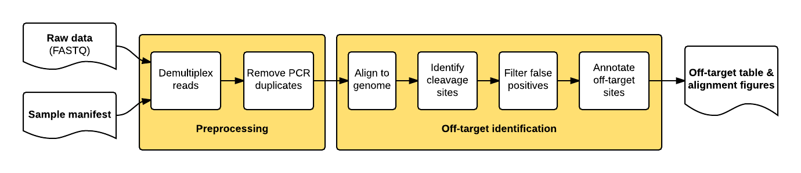

# guideseq: The GUIDE-Seq Analysis Package
[](https://travis-ci.org/aryeelab/guideseq)

The guideseq package implements our data preprocessing and analysis pipeline for GUIDE-Seq data. It takes raw sequencing reads (FASTQ) and a parameter manifest file (.yaml) as input and produces a table of annotated off-target sites as output.


## Features


The package implements a pipeline consisting of a read preprocessing module followed by an off-target identification module. The preprocessing module takes raw reads (FASTQ) from a pooled multi-sample sequencing run as input. Reads are demultiplexed into sample-specific FASTQs and PCR duplicates are removed using unique molecular index (UMI) barcode information.



The individual pipeline steps are:

1. **Sample demultiplexing**: A pooled multi-sample sequencing run is demultiplexed into sample-specific read files based on sample-specific dual-indexed barcodes
2. **PCR Duplicate Consolidation**:Reads that share the same UMI and the same first six bases of genomic sequence are presumed to originate from the same pre-PCR molecule and are thus consolidated into a single consensus read to improve quantitative interpretation of GUIDE-Seq read counts.
3. **Read Alignment**: The demultiplexed, consolidated paired end reads are aligned to a reference genome using the BWA-MEM algorithm with default parameters (Li. H, 2009).
4. **Candidate Site Identification**: The start mapping positions of the read amplified with the tag-specific primer (second of pair) are tabulated on a genome-wide basis. Start mapping positions are consolidated using a 10-bp sliding window. Windows with reads mapping to both + and - strands, or to the same strand but amplified with both forward and reverse tag-specific primers, are flagged as sites of potential DSBs. 25 bp of reference sequence is retrieved on either side of the most frequently occuring start-mapping position in each flagged window. The retrieved sequence is aligned to the intended target sequence using a Smith-Waterman local-alignment algorithm. 
5. **False positive filtering**: Off-target cleavage sites with more than six mismatches to the intended target sequence, or that are present in background controls, are filtered out.
6. **Reporting**: Identified off-targets, sorted by GUIDE-Seq read count are annotated in a final output table. The GUIDE-Seq read count is expected to scale approximately linearly with cleavage rates (Tsai et al., *Nat Biotechnol.* 2015).
7. **Visualization**: Alignment of detected off-target sites is visualized via a color-coded sequence grid, as seen below:


## Dependencies
* Python (2.7)
* Reference genome fasta file ([Example](http://www.broadinstitute.org/ftp/pub/seq/references/Homo_sapiens_assembly19.fasta))
* [`bwa`](<http://bio-bwa.sourceforge.net/>) alignment tool
* [`bedtools`](<http://bedtools.readthedocs.org/en/latest/>) genome arithmetic utility

## Getting Set Up

### Install Dependencies

To run guideseq, you must first install all necessary dependencies:

- **Python 2.7**: If a version does not come bundled with your operating system, we recommend the [Anaconda](https://www.continuum.io/downloads) scientific Python package.
- **Burrows-Wheeler Aligner (bwa)**: You can either install bwa with a package manager (`brew` on OSX or `apt-get` on Linux), or you can download it from the [project page](http://bio-bwa.sourceforge.net/) and compile it from source.
- **Bedtools**: You can either install bwa with a package manager (`brew` on OSX or `apt-get` on Linux), or you can download it from the [project page](http://bedtools.readthedocs.org/en/latest/content/installation.html) and compile it from source.

For both bwa and bedtools, make sure you know the path to the respective executables, as they are necessary pipeline inputs.


### Download Reference Genome

The guideseq package requires a reference genome for read mapping. You can use any modern human reference genome of your choosing, but for all of our testing and original GUIDE-seq analyses (Tsai et al. *Nature Biotechnol* 2015) we use hg19 ([download](http://www.broadinstitute.org/ftp/pub/seq/references/Homo_sapiens_assembly19.fasta)). Be sure to unzip the gunzipped FASTA file before use.

### Download and Set Up guideseq

Once all dependencies are installed, there are a few easy steps to download and set up the guideseq package:

1. Obtain a copy of the guideseq package source code. You can either download and unzip the latest source from the github [release page](https://github.com/aryeelab/guideseq/releases), or you use git to clone the repository by running `git clone --recursive https://github.com/aryeelab/guideseq.git`
2. Install guideseq dependencies by entering the guideseq directory and running `pip install -r requirements.txt`

Once all guideseq dependencies are installed, you will be ready to start using guideseq!


## Running the Full Analysis Pipeline

To run the full guideseq analysis pipeline, you must first create a manifest YAML file that describes all pipeline inputs. Once you have done so, you can simply run

```
python /path/to/guideseq.py all -m /path/to/manifest.yaml
```
to run the entire pipeline. Below are specific instructions detailing how to write the manifest file.

### Writing A Manifest File
When running the end-to-end analysis functionality of the guideseq package, a number of inputs are required. To simplify the formatting of these inputs and to encourage reproducibility, these parameters are inputted into the pipeline via a manifest formatted as a YAML file. YAML files allow easy-to-read specification of key-value pairs. This allows us to easily specify our parameters. The following fields are required in the manifest:

- `reference_genome`: The absolute path to the reference genome FASTA file.
- `output_folder`: The absolute path to the folder in which all pipeline outputs will be saved.
- `bwa`: The absolute path to the `bwa` executable
- `bedtools`: The absolute path to the `bedtools` executable
- `undemultiplexed`: The absolute paths to the undemultiplexed paired end sequencing files. The required parameters are:
	- `forward`: The absolute path to the FASTQ file containing the forward reads.
	- `reverse`: The absolute path to the FASTQ file containing the reverse reads.
	- `index1`: The absolute path to the FASTQ file containing the forward index reads.
	- `index2`: The absolute path to the FASTQ file containing the reverse index reads.

An example `undemultiplexed` field:

```
undemultiplexed:
    forward: ../test/data/undemux.r1.fastq.gz
    reverse: ../test/data/undemux.r2.fastq.gz
    index1: ../test/data/undemux.i1.fastq.gz
    index2: ../test/data/undemux.i2.fastq.gz
```

- `samples`: A nested field containing the details of each sample. At least two samples must be specified: a "control" sample (to be used to filter out background off-target sites) and at least one treatment sample. The required parameters are:
	- `target`: The sample targetsites
	- `barcode1`: The forward barcode
	- `barcode2`: The reverse barcode
	- `description`: A description of the sample

An example `samples` field:

```
samples:
    control:
        target:
        barcode1: CTCTCTAC
        barcode2: CTCTCTAT
        description: Control

    [SAMPLENAME]:
        target: GAGTCCGAGCAGAAGAAGAANGG
        barcode1: TAGGCATG
        barcode2: TAGATCGC
        description: EMX1
```

### A Full Manifest File Example

Below is an example of a full manifest file. Feel free to copy it and replace the parameters with your own experiment data. Remember that you can input more than just one treatment sample (e.g. the "EMX1" data below).

```
reference_genome: /Volumes/Media/hg19/hg19.fa
output_folder: ../test/output

bwa: bwa
bedtools: bedtools

undemultiplexed:
    forward: ../test/data/undemux.r1.fastq.gz
    reverse: ../test/data/undemux.r2.fastq.gz
    index1: ../test/data/undemux.i1.fastq.gz
    index2: ../test/data/undemux.i2.fastq.gz

samples:
    control:
        target:
        barcode1: CTCTCTAC
        barcode2: CTCTCTAT
        description: Control

    EMX1:
        target: GAGTCCGAGCAGAAGAAGAANGG
        barcode1: TAGGCATG
        barcode2: TAGATCGC
        description: EMX1
```

### Pipeline Output

When running the full pipeline, the results of each step are outputted to the `output_folder` in a separate folder for each step. The final detected off-target sites are placed in the `output_folder/identified` folder, with one `.txt` file for each sample specified in the manifest. The fields that are populated in each row of these off-target files are specified below:

**Output Off-Targets `.txt` Fields**:

- `BED Chromosome`
- `BED Min.Position`
- `BED Max.Position`
- `BED Name`
- `Filename`
- `WindowIndex`
- `Chromosome`
- `Position`
- `Sequence`
- `+.mi`
- `-.mi`
- `bi.sum.mi`
- `bi.geometric_mean.mi`
- `+.total`
- `-.total`
- `total.sum`
- `total.geometric_mean`
- `primer1.mi`
- `primer2.mi`
- `primer.geometric_mean`
- `position.stdev`
- `Off-Target Sequence`
- `Mismatches`
- `Length`
- `BED off-target Chromosome`
- `BED off-target start`
- `BED off-target end`
- `BED off-target name`
- `BED Score`
- `Strand`
- `Cells`
- `Targetsite`
- `Target Sequence`

## Running Analysis Steps Individually

In addition to end-to-end pipeline analysis functionality, the guideseq package also allows for every step fo the analysis to be run individually. Here we have detailed the required inputs and expected outputs of each step.

### `demultiplex` Pooled Multi-Sample Sequencing (Manifest Required)

- **Functionality**: Given undemultiplexed sequence files and sample barcodes specified in the manifest, output the demultiplexed sample-specific reads in FASTQ format. The forward, reverse, and two index files for each sample in the manifest	 are outputted to the `output_folder/consolidated` folder.
- **Required Parameters**:
	- `-m or --manifest`: Specify the path to the manifest YAML file
- **Example Usage**:
	- `python /path/to/guideseq.py demultiplex -m /path/to/manifest.yaml`

### `umitag` Reads (Manifest Required)

- **Functionality**: Given the demultiplexed files in the folder `output_folder/undemultiplexed` (where `output_folder` is specified in the manifest), umitag the reads for downstream consolidation. The forward and reverse files for each sample in the manifest are outputted to the `output_folder/umitagged` folder.
- **Required Parameters**:
	- `-m or --manifest`: Specify the path to the manifest YAML file
- **Example Usage**:
	- `python /path/to/guideseq.py umitag -m /path/to/manifest.yaml`

### `consolidate` PCR Duplicates

- **Functionality**: Given undemultiplexed sequence files and sample barcodes specified in the manifest, output the consolidated forward and reversed reads to the `outfolder`.
- **Required Parameters**:
	- `--read1`: Path to the forward umitagged reads file (FASTQ)
	- `--read2`: Path to the reverse umitagged reads file (FASTQ)
	- `--outfolder`: Path to the folder in which the output files will be saved
- **Optional Parameters**:
	- `--min_quality`: The minimum quality of a read for it to be considered in the consolidation
	- `--min_frequency`: The minimum frequency of a read for the position to be consolidated
- **Example Usage**:
	- `python /path/to/guideseq.py consolidate --read1 /data/control_read1.fastq --read2 /data/control_read2.fastq --outfolder /data/output`

### `align` Sites to Genome

- **Functionality**: Given the consolidated forward and reverse reads, execute a paired-end mapping of the sequences to the reference genome using the `bwa` package. Outputs an alignment `.sam` file to the `outfolder`.
- **Required Parameters**:
	- `--bwa`: Path to the `bwa` executable
	- `--genome`: Path to the reference genome FASTA file
	- `--read1`: Path to the consolidated forward read FASTQ file
	- `--read2`: Path to the consolidated reverse read FASTQ file
	- `--outfolder`: Path to the folder in which the output files will be saved
- **Example Usage**:
	- `python /path/to/guideseq.py align --bwa /usr/bin/bwa --genome /data/hg19.fasta --read1 /data/control_read1.fastq --read2 /data/control_read2.fastq --outfolder /data/output`

### `identify` Off-target Site Candidates

- **Functionality**: Given the alignment samfile for a given site, a reference genome, and a target sequence, output a tab-delimited `.txt` file containing the identified off-target sites.
- **Required Parameters**:
	- `--aligned`: Path to the site-specific alignment `.sam` file.
	- `--genome`: Path to the reference genome FASTA file.
	- `--outfolder`: Path to the folder in which the output files will be saved.
	- `--target_sequence`: The sequence targeted in the sample (blank for control sample)
- **Optional Parameters**:
	- `--description`: Specify additional information about the sample.
- **Example Usage**:
	- `python /path/to/guideseq.py identify --aligned /data/aligned/EMX1.sam --genome /data/hg19.fasta --outfolder /data/output --target_sequence GAGTCCGAGCAGAAGAAGAANGG --description EMX1`

### `filter` Background DSB Sites

- **Functionality**: Given the identified site `.txt` files for a treatment and control samples, output a `.txt` file in the same format as outputted by the `identify` step containing the sites filtered out as false-positives.
- **Required Parameters**:
	- `--bedtools`: Path to the `bedtools` executable
	- `--identified`: Path to the `.txt` file outputted by the `identify` step for a treatment sample.
	- `--background`: Path to the `.txt` file outputted by the `identify` step for a control sample.
	- `--outfolder`: Path to the folder in which the output files will be saved.
- **Example Usage**:
	- `python /path/to/guideseq.py filter --bedtools /usr/bin/bedtools --identified /data/identified/EMX1.txt --background /data/identified/control.txt --outfolder /data/output`

### `visualize` Detected Off-Target Sites

- **Functionality**: Given an identified off-target sites `.txt` file, output an alignment visualization of the off-target sites.
- **Required Parameters**:
	- `--infile`:  Path to the input `.txt.` off-targets file
	- `--outfile`: Path to the outputted `.svg` graphic
- **Optional Parameters**:
	- `--title`: Specify the title of the visualization, to be printed at the top of the graphic. Useful for posters and presentations.
- **Example Usage**:
	- `python /path/to/guideseq.py visualize --infile /data/identified/EMX1.txt --outfile /data/visualization/EMX1 --title EMX1_Offtargets`

## Testing the guideseq Package

In the spirit of Test-Driven Development, we have written end-to-end tests for each step of the pipeline. These can be used to ensure that the software is running with expected functionality.

NOTE: Due to differences in sorting between different versions of the `bwa` package, you must be using `bwa v0.7.9a` for these tests to work. We also recommend that you use `bedtools v2.25.0` when running these tests for consistency's sake.

### Single-Step Regression Tests

For ongoing testing and development, we have created an abridged set of input data and expected output data for each step of the pipeline. This way, changes to the pipeline can be quickly tested for feature regression.

To run these tests, you must first install the `nose` testing Python package.

```
pip install nose
```

Then, from the guideseq root directory, simply run

```
nosetests
```

and the regression tests for each pipeline step will be run.

### Full Large Test

If you have more time, we have prepared a bash script that downloads and compiles all dependencies from source, downloads a fresh reference genome and full GUIDE-seq sequencing data, and performs a full test of the entire pipeline. This test takes a long time, but we require that it be run before we commit a new release.

To run the full large test, enter the `guideseq/test` folder and run

```
./large_test.sh
```

Then, sit back and watch the full large testing process unfold automatically in the terminal.

### Manual Testing

If you wish to run a full GUIDE-Seq dataset through the analysis pipeline, you may find it and a test manifest (to be altered depending on your dependency locations) here:

```
http://aryee.mgh.harvard.edu/guideseq/data/guideseq_test_fastq.zip
```

which should be used with the following reference genome:

```
http://www.broadinstitute.org/ftp/pub/seq/references/Homo_sapiens_assembly19.fasta
```
