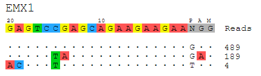

===============================
guideseq
===============================

Open-Source Software for Analysis of GUIDE-seq Data

.. image:: https://travis-ci.org/aryeelab/guideseq.svg
    :target: https://travis-ci.org/aryeelab/guideseq

.. .. image:: https://readthedocs.org/projects/guideseq/badge/?version=latest
..         :target: http://guideseq.readthedocs.org/en/latest/
..         :alt: Documentation Status

The guideseq package implements our data preprocessing and analysis pipeline for GUIDE-Seq data. It takes raw sequencing reads (FASTQ) as input and produces a table of annotated off-target sites as output.

Features
=========
The package implements a pipeline consisting of a read preprocessing module followed by an off-target identification module. The preprocessing module takes raw reads (FASTQ) from a pooled multi-sample sequencing run as input. Reads are demultiplexed into sample-specific FASTQs and PCR duplicates are removed using unique molecular index (UMI) barcode information.

.. image:: guideseq_flowchart.png

This package also produces visualizations of detected off-target sites, as seen below.

Dependencies
=======

* Python (2.6, 2.7, or PyPy)
* `bwa <http://bio-bwa.sourceforge.net/>`_ alignment tool
* `bedtools <http://bedtools.readthedocs.org/en/latest/>`_ genome arithmetic utility
* Reference genome fasta file (`Example <http://ftp.ensembl.org/pub/release-82/fasta/homo_sapiens/dna/Homo_sapiens.GRCh38.dna_sm.primary_assembly.fa.gz>`_)

Getting Set Up
==============

Using this software is easy, just make sure you have all of the dependencies installed and then grab a copy of this repository.

1. Download the ``bwa`` executable from their `website <http://bio-bwa.sourceforge.net/>`_. Extract the file and make sure you can run it by typing ``/path/to/bwa`` and getting the program's usage page.

2. Download the ``bedtools`` package by following directions from their `website <http://bedtools.readthedocs.org/en/latest/content/installation.html>`_. Make sure you can run it by typing ``/path/to/bedtools`` or just ``bedtools`` and get the program's usage page.

3. Make sure you have a copy of a reference genome fasta file. (`Example <http://ftp.ensembl.org/pub/release-82/fasta/homo_sapiens/dna/Homo_sapiens.GRCh38.dna_sm.primary_assembly.fa.gz>`_)

4. Download and extract the ``guideseq`` package. You can do this either by downloading the zip and extracting it manually, or by cloning the repository ``git clone --recursive https://github.com/aryeelab/guideseq.git``.

5. Install the ``guideseq`` dependencies by entering the ``guideseq`` directory and running ``pip install -r requirements.txt``.

Usage
=======

Using this tool is simple, just create a ``.yaml`` manifest file referencing the dependencies and sample ``.fastq.gz`` file paths. Then, run ``python /path/to/guideseq.py all -m /path/to/manifest.yaml``

Below is an example ``manifest.yaml`` file::

    reference_genome: /Volumes/Media/hg38/hg38.fa
    output_folder: ../test/output

    bwa: bwa
    bedtools: bedtools

    undemultiplexed:
        forward: ../test/data/undemux.r1.fastq.gz
        reverse: ../test/data/undemux.r2.fastq.gz
        index1: ../test/data/undemux.i1.fastq.gz
        index2: ../test/data/undemux.i2.fastq.gz

    samples:
        control:
            target:  
            barcode1: CTCTCTAC
            barcode2: CTCTCTAT
            description: Control

        EMX1:
            target: GAGTCCGAGCAGAAGAAGAANGG
            barcode1: TAGGCATG
            barcode2: TAGATCGC
            description: Round 3 Adli

Absolute paths are recommended. Be sure to point the ``bwa`` and ``bedtools`` paths directly to their respective executables.

Once you have a manifest file created, you can simply execute ``python PATH/TO/guideseq.py all -m PATH/TO/MANIFEST.YAML`` to run the entire pipeline. All output files, including the results of each individual step, will be placed in the ``output_folder``.

Running Pipeline Steps Individually
===================================

You can also run each step of the pipeline individually by running ``python PATH/TO/guideseq.py [STEP] [OPTIONS]``. Supported commands are:

* ``all``: Run all pipeline steps (manifest required)
* ``demultiplex``: Demultiplex undemultiplexed files (manifest required)
* ``umitag``: UMI-tag demultiplexed files
* ``consolidate``: Consolidate UMI-tagged files
* ``align``: Align consolidated reads to a reference genome
* ``identify``: Identify offtarget sites from aligned reads
* ``filter``: Filter identified background sites from identified treatment sites
* ``visualize``: Produce visualization of off-target sites from result of the ``identify`` step

Testing
=======

To run tests, make sure you have ``bedtools`` and ``bwa v0.7.9a`` (using this specific version is important, otherwise sorting differences will cause tests to fail). Then, you can simply run ``nosetests`` from the ``guideseq`` root folder to test the full pipeline.

License
========

This software is licensed under the GNU AGPLv3 license. For usage information about this license, see the GNU AGPL `information page <http://www.gnu.org/licenses/agpl-3.0.en.html>`_.
