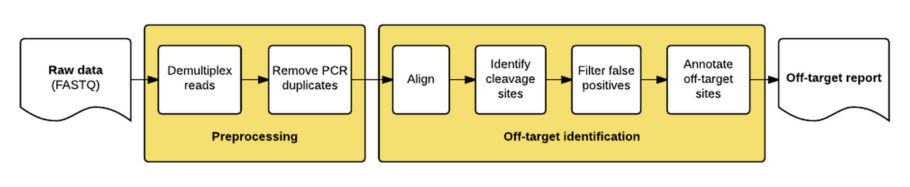

===============================
GUIDE-Seq
===============================

.. .. image:: https://img.shields.io/travis/vedtopkar/guideseq.svg
..         :target: https://travis-ci.org/vedtopkar/guideseq

.. .. image:: https://coveralls.io/repos/vedtopkar/guideseq/badge.svg?branch=master 
..         :target: https://coveralls.io/r/vedtopkar/guideseq?branch=master

.. .. image:: https://img.shields.io/pypi/v/guideseq.svg
..         :target: https://pypi.python.org/pypi/guideseq

.. .. image:: https://readthedocs.org/projects/guideseq/badge/?version=latest
..         :target: http://guideseq.readthedocs.org/en/latest/
..         :alt: Documentation Status

The guideseq package implements our data preprocessing and analysis pipeline for GUIDE-Seq data. It takes raw sequencing reads (FASTQ) as input and produces a table of annotated off-target sites as output.

Features
=========
The package implements a pipeline consisting of a read preprocessing module followed by an off-target identification module. The preprocessing module takes raw reads (FASTQ) from a pooled multi-sample sequencing run as input. Reads are demultiplexed into sample-specific FASTQs and PCR duplicates are removed using unique molecular index (UMI) barcode information.

Dependencies
=======

* Python (2.6, 2.7, or PyPy)
* `bwa <http://bio-bwa.sourceforge.net/>`_ alignment tool
* `bedtools <http://bedtools.readthedocs.org/en/latest/>`_
* Reference genome .fasta file (we recommend `hg19 <http://genome.ucsc.edu/cgi-bin/hgGateway?hgsid=431825753_a0WJjTe0PI8wUUlzy80AAMLzPJg4&clade=mammal&org=Human&db=hg19>`_)

Getting Set Up
==============

Using this software is easy, just make sure you have all of the dependencies installed and then grab a copy of this repository.

1. Download the ``bwa`` executable from their `website<http://bio-bwa.sourceforge.net/>`_. Extract the file and make sure you can run it by typing ``/path/to/bwa`` and getting the program's usage page.

2. Download the ``bedtools`` package by following directions from their `website<http://bedtools.readthedocs.org/en/latest/content/installation.html>`_. Make sure you can run it by typing ``/path/to/bedtools`` or just ``bedtools`` and get the program's usage page.

3. Download and extract the ``guideseq`` package. You can do this either by downloading the zip and extracting it manually, or by cloning the repository ``git clone https://github.com/aryeelab/guideseq.git``.

Usage
=======

Using this tool is simple, just create a ``.yaml`` manifest file referencing the dependencies and sample ``.fastq.gz`` file paths. Then, run ``python /path/to/guideseq.py -m /path/to/manifest.yaml``

Below is an example ``manifest.yaml`` file::

    reference_genome: /Volumes/Media/hg38/hg38.fa
    output_folder: ../test/output

    bwa: bwa
    bedtools: bedtools

    undemultiplexed:
        forward: ../test/data/undemux.r1.fastq.gz
        reverse: ../test/data/undemux.r2.fastq.gz
        index1: ../test/data/undemux.i1.fastq.gz
        index2: ../test/data/undemux.i2.fastq.gz

    samples:
        control:
            target: 
            barcode: TCTCTACTCTCTAT
            description: Control
            treatment: No Nuclease
            cell_type: 293

        EMX1:
            target: GAGTCCGAGCAGAAGAAGAANGG
            barcode: AGGCATGAGATCGC
            description: Round 3 Adli
            treatment: discovery
            cell_type: 293

Absolute paths are recommended. Be sure to point the ``bwa`` and ``bedtools`` paths directly to their respective executables.

Once you have a manifest file created, you can simply execute ``python guideseq.py -m PATH/TO/MANIFEST.YAML`` to run the entire pipeline.

You cannot yet run steps of the pipeline individually, though this functionality is planned for future releases.

License
========
[License Information]

Disclaimer
==========
[Disclaimer]